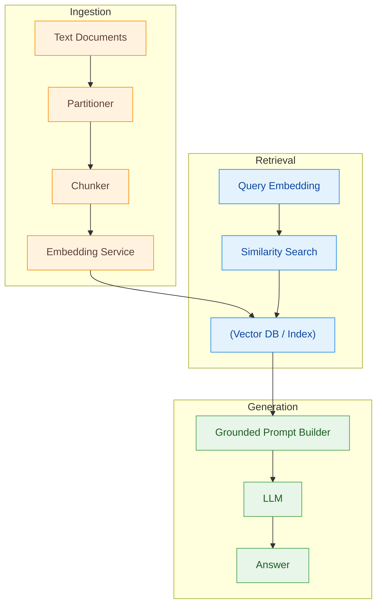

# RAG (Retrieval‑Augmented Generation) POC
This is a small personal experiment to explore how a RAG setup works using plain text documents. The idea is simple: instead of relying only on what an LLM already knows, we give it extra context pulled from your own files. That way, the model can answer questions using information that actually matters for your project.
This POC focuses on taking raw text, breaking it into useful pieces, embedding it, storing it, and then pulling the right chunks back out when a user asks something.

## 🚀 What This POC Does

- Splits raw documents into sections
- Breaks those sections into chunks
- Turns chunks into embedding vectors
- Stores everything inside a vector database
- Converts user prompts into query embeddings
- Performs semantic similarity search to find matching chunks
- Builds a context‑rich prompt for the LLM
- Generates a grounded answer based on actual content

## Instructions
- Install Docker and Podman
- Init a Podman machine:```podman init machine```
- Make sure Podman has enough memory to host all the containers (3 gigs should be fine): ```podman machine set --memory 3072```
- Start Podman machine: ```podman machine start```
- Build and run: ```podman compose up --build```
  - Starts all the PODs including the Vector DB and LLM
  - This step will take a few minutes to build the images and pull the LLM
- Copy ```./sample-data/book-war-and-peace-ch-01.txt``` into ```./data/ingest/inbox```
  - This will kick-off the file processing the ultimately insert the embeds into the vector db.
- Give it a simple test: `http://localhost:8010/`
  - Example: ```What is Anna Pavlovna's view about Russia's role in Europe?```
- Shutdown all containers: ```podman compose down```

## 💡 Interesting Bits
- [Text Ingest File Chunking](https://github.com/aam134134/ai-rag-text-vector/blob/7afefe55f518d57ce445cc0069261502dfe6446b/text-ingest/file_watcher.py#L38-L47)

- [Text Chunk Embedding Model](https://github.com/aam134134/ai-rag-text-vector/blob/d7b24310eea4dd2f15965dad775d43ef0fe9cd6c/chunk-embedding/embed_chunks.py#L20)
- [Text Chunk Embedding](https://github.com/aam134134/ai-rag-text-vector/blob/26b7ec9d05ede579e7fd596d24a8056f0870c770/chunk-embedding/embed_chunks.py#L43-L55)

- [Ollama Model](https://github.com/aam134134/ai-rag-text-vector/blob/d7b24310eea4dd2f15965dad775d43ef0fe9cd6c/ask/ask_vector_data.py#L10) 

- [LLM System Prompt](https://github.com/aam134134/ai-rag-text-vector/blob/d7b24310eea4dd2f15965dad775d43ef0fe9cd6c/ask/ask_vector_data.py#L13-L28)


## 🔄 RAG Workflow (High‑Level Overview)
1. Document Processing

   - Raw text is split into meaningful sections, keeping natural boundaries intact.
   - These sections are then chunked into smaller, retrieval‑friendly pieces.
1. Embedding
   
   - Each chunk is converted into a high‑dimensional vector that represents its semantic meaning.
   - All embeddings are stored in a vector store for fast similarity lookups.
1. Retrieval

   - When a user asks a question, the prompt is converted into a query embedding.
   - A nearest‑neighbor search finds the chunks most related to the user's intent.
1. LLM Response
   - The retrieved chunks are added to the LLM prompt as context.
   - The model responds using both its own knowledge and the actual content of your documents—producing a more accurate, grounded result.

## 🏗️ Component View — System Architecture

